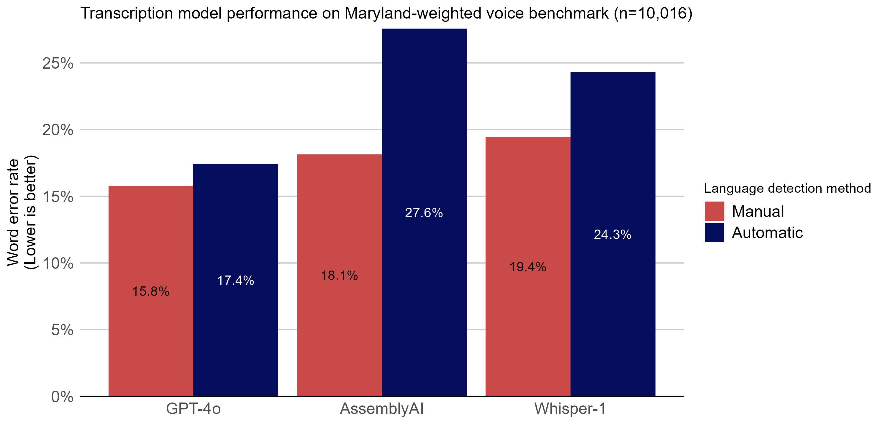
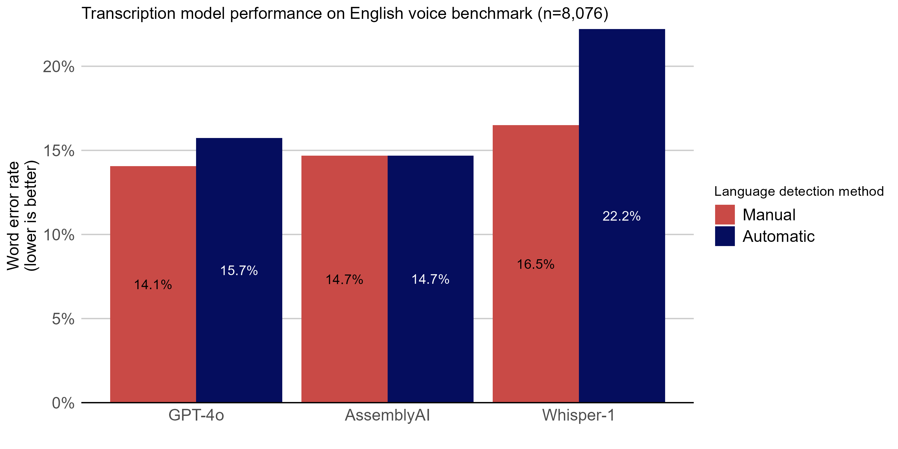
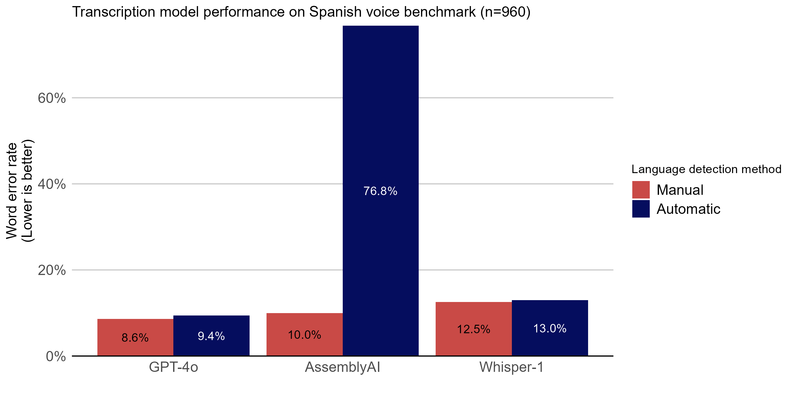
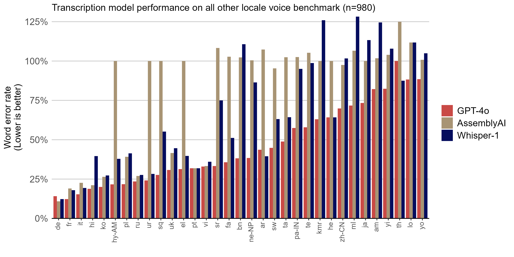

# State-Transcription-Benchmark
A pipeline to construct and test state-specific audio transcription benchmarks

## Results

### Overall model performance on the Maryland-weighted 10,000 voice benchmark



In a voice benchmark of over 10,000 samples, weighted according to how often those languages are spoken at home in Maryland, GPT-4o-transcribe in manual detection mode was the most accurate model tested, scoring an average word-error-rate of 15.8%. For all three models tested, automatic language detection yielded considerably worse error rates. As error rates of 20% or higher are considered difficult to interpret, neither AssemblyAI nor Whisper-1 in automatic detection mode are recommended for the mix of languages commonly spoken in Maryland.

### Individual locale performance





Notable findings:

- Even when exclusively operating on English-language voice samples, both OpenAI models performed better in manual language detection mode.
- Although AssemblyAI performed well with automatic detection in English, its tendency to assume English led to worse performance in Spanish and other languages.
- The only languages that meet the 20% threshold of interpretability for these models are: English (en), Spanish (sp), German (de), French (fr), Italian (it), Hindi (hi, only GPT-4o), and Korean (ko, only GPT-4o).

## Methodology

### Benchmark dataset construction

The benchmark dataset is constructed using the following steps:

1. **Fetch Language Data**: The script retrieves the percentage of languages spoken at home in a given state (in this case Maryland) using the US Census Bureau's ACS 5-Year data. This requires a valid `CENSUS_API_KEY` in the `.env` file.

2. **Filter Languages**: The script maps the ACS language codes to their corresponding Mozilla Common Voice version 17 dataset codes. Languages not represented in the Common Voice dataset are excluded, and their percentages are redistributed proportionally among the represented languages.

3. **Download Common Voice Data**: For each represented language, the script downloads the required number of samples (in this case, at least 10,000) from the Mozilla Common Voice dataset. The number of samples is proportional to the percentage of speakers of that language in the state.

4. **Adjust for Missing Data**: If sufficient samples for a language are not available, a warning is logged, and the dataset is constructed with the available samples.

This process ensures that the dataset reflects the linguistic diversity of the specified state while leveraging the Mozilla Common Voice dataset for audio samples.

### Benchmarking models

Three models were chosen to test against the Maryland-weighted voice benchmark, Whisper-1, AssemblyAI, and GPT-4o-transcribe. Whisper-1 was chosen as a baseline model due to its prevalence, AssemblyAI was chosen because is likely the source of transcriptions in the Hey Marvin tool, and GPT-4o-transcribe was chosen because it is SOTA. For all three models, tests were run in both manual and automatic detection modes. In manual mode, the known locale of the voice sample was specified to the model during transcription. In automatic mode, the model was responsible for identifying the language.

## Technical details

### Setup
1. Register for a US Census API key and enter CENSUS_API_KEY in .env file
2. Register for Huggingface account and enter HF_TOKEN in .env file
3. Visit [Mozilla's Common Voice Corpus 17.0](https://huggingface.co/datasets/mozilla-foundation/common_voice_17_0) and accept the terms of use

### Installation

```bash
python -m virtualenv venv
.\venv\Scripts\activate
pip install -r requirements.txt
```

### Use as an import
```python
from benchmark_dataset import construct_dataset

# Construct a Maryland-weighted voice dataset with no fewer than 10,000 samples
my_state_dataset = construct_dataset('MD', 10000)
```

### CLI use
```bash
python benchmark_dataset.py MD # Save a Maryland dataset of >10,000 samples as ./MD_voice_dataset
python run_openai_benchmark.py # Run a WER evaluation of Whisper/gpt-4o ./MD_voice_dataset
python run_assemblyai_benchmark.py # Run a WER evaluation of AssemblyAI ./MD_voice_dataset
```